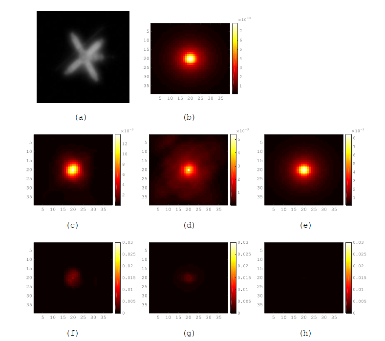
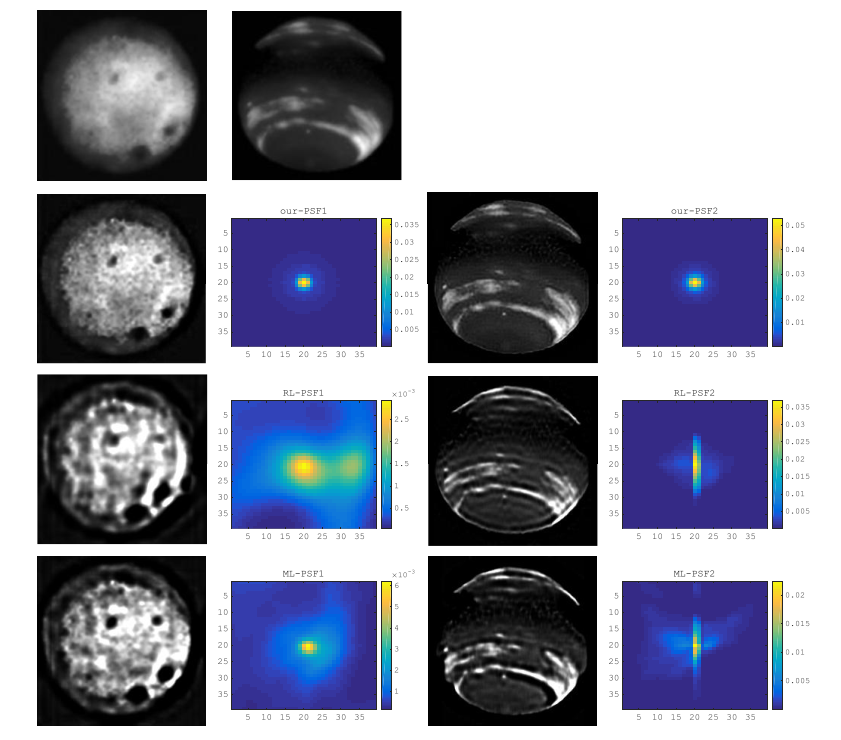

## 0. Citation

**If you find our code helpful in your research or work please cite our paper.The paper has been submitted to The Astrophysical Journal, and a link to the paper will be published in the post.**

```
@article{PSF estimation for adaptive optics imaging,
  title = {PSF estimation for adaptive optics imaging: PSF estimation for adaptive optics imaging of astronomical extended objects},
  author = {Ma Long, Yang Soubo, Ni Weiping, Xiao Feng, Yu Jun},
  journal = {The Astrophysical Journal},
  year = 2019
}
```

## 1. Environmental preparation
- python 3.6
- NVIDIA GPU + CUDA CuDNN
- Pytorch version 0.3.0

## 2. Implementation process
Step 1：generating PSFs--->Step 2: blurring images--->Step 3: training networks--->Step 4: test

## 3.  Experiments
We tested the proposed PSF estimation framework on the Keck AO systems. Two groups of experiments were conducted to test the proposed method. The first one is referred to as PSF identification. In this experiment, we assume that each degraded image is blurred by a PSF from a set containing fixed kinds of PSFs, and we apply the networks to identify the PSF. The second experiment, which is much more challenging than the first one, is referred to as PSF prediction. In this experiment, we assume that each degraded image is blurred by a PSF from a set containing infinite kinds of PSFs. Thus, its PSF may be different from that of any other images. We apply the networks to predict the distribution of the PSF.

### 3.1 PSF Identifications
In this experiment, we train the networks using 181 fixed PSFs and the corresponding degraded images blurred by them. For comparison, we sample 100 images from the test data set and process them using RL-AIBD and ML-IBD. The average RMSE of the three methods are shown in Table 1, and some examples of PSF estimation results are shown in Figure 1. Table 1 also gives the results of the three methods for the pure test data. 
    
**Figure 1, Examples of PSF estimation results. (a) The test image, (b) the ground truth, (c) RL-AIBD method, (d) ML-IBD method, (e) proposed method, (f) residual error of (c), (g) residual error of (d), and (h) residual error of (e).**
<br><br>

  
|  |**RL-AIBD**|**ML-IBD**|**Propose method**|
|:---:|:---:|:---:|:---:
|**Test data**|0.0009552|0.00282314|0.00007723|
|**Pure test data**|0.00105331|0.00271948|0.00007817|

**Table 1, The RMSE Values of the Three Methods in the Identification Experiment**

### 3.2 PSF Prediction
In this experiment, we train the networks as in the PSF identification experiment above. The main difference is that we do not specify PSF parameters but randomly sample a range of parameter values during the generation of PSFs.

#### 3.2.1 Simulated Images
First, we test the well-trained networks using the simulated test data set. We perform comparison experiments similar to those in the identification experiment by sampling 100 images from the common test data set and pure test data and then processing the samples with the proposed method, RL-AIBD and ML-IBD. The RMSEs of the three methods are shown in Table 2.

|  |**RL-AIBD**|**ML-IBD**|**Propose method**|
|:---:|:---:|:---:|:---:
|**Test data**|0.00102319|0.000981637|0.00016394|
|**Pure test data**|0.00095980|0.001397238|0.00016512|

**Table 4， The RMSE values of the three methods in the prediction experiment**

#### 3.2.2 Real Images
Since the well-trained networks can predict PSFs that do not emerge in the training stage, we attempted to process the real images captured by the Keck AO systems. Since the groundtruth PSFs are unknown, we adopt the following test methods: the PSF estimation method is used to estimate the PSF of each blurred image, and then the PSF is used to deconvolute the blurred image. Finally, the performance of the estimation method is evaluated by the clarity of the resulting image.  We test the three methods with the AO images of Io and Saturn, as captured by the Keck AO system, and the results are shown in Figure 2.  

**Figure 2, Deconvolution results using PSFs with estimated different methods. The columns (from top to bottom) contain Io and Saturn, and the rows (from left to right) contain the original blurred images and the results obtained with the proposed method, RL-AIBD, and ML-IBD.**


