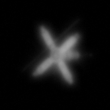
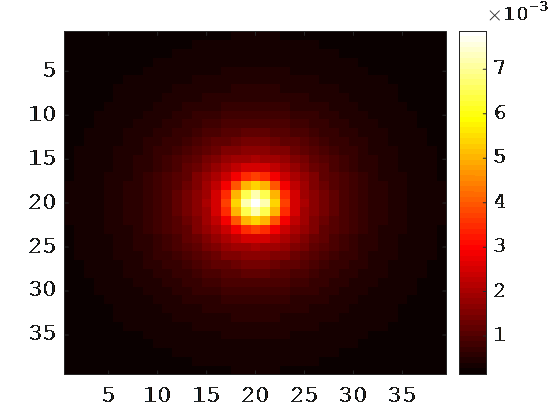
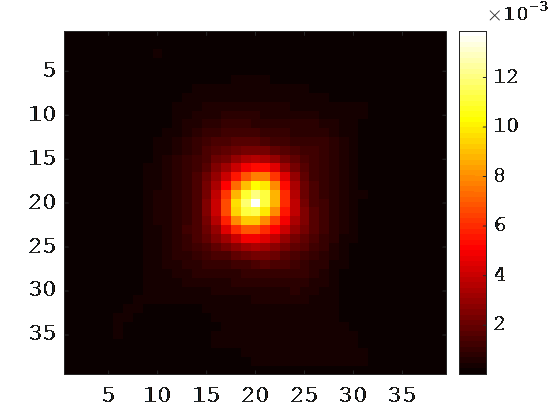
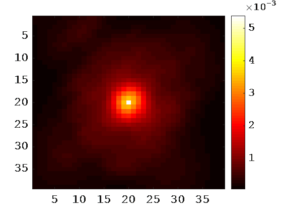
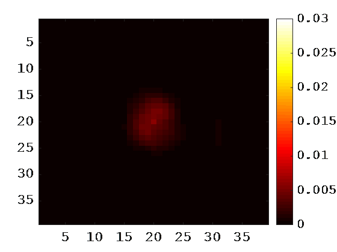
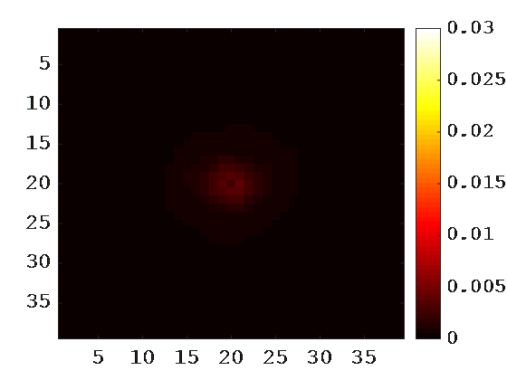
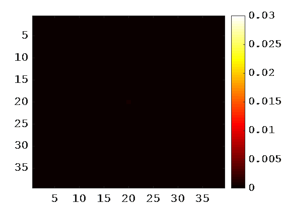

## 1. Environmental preparation
- python 3.6
- NVIDIA GPU + CUDA CuDNN
- Pytorch version 0.3.0

## 2. Implementation process
Step 1：generating PSFs--->Step 2: blurring images--->Step 3: training networks--->Step 4: test

## 3.  Experiments
We tested the proposed PSF estimation framework on the Keck AO systems (Drummond & Christou 2009). Two groups of experiments were conducted to test the proposed method. The first one is referred to as PSF identification. In this experiment, we assume that each degraded image is blurred by a PSF from a set containing fixed kinds of PSFs, and we apply the networks to identify the PSF. The second experiment, which is much more challenging than the first one, is referred to as PSF prediction. In this experiment, we assume that each degraded image is blurred by a PSF from a set containing infinite kinds of PSFs. Thus, its PSF may be different from that of any other images. We apply the networks to predict the distribution of the PSF.

### 3.1 PSF Identifications
For comparison, we sample 100 images from the test data set and process them using RL-AIBD and ML-IBD. The average RMSE of the three methods are shown in Table 1, and some examples of PSF estimation results are shown in Figure 1. The results indicate that among the three methods, the proposed method achieves the lowest error. Moreover, the structure of the PSFs estimated with our proposed method matches well with the ground truth. Table 2 also gives the results of the three methods for the pure test data. The proposed method again yields the lowest RMSE. Moreover, the RMSE of the pure test data is similar to the RMSE of the common test data, which illustrates that the trained networks have strong generalization power since none of the cognate information about the pure test data is used in the training stage.
 
 
 
 

